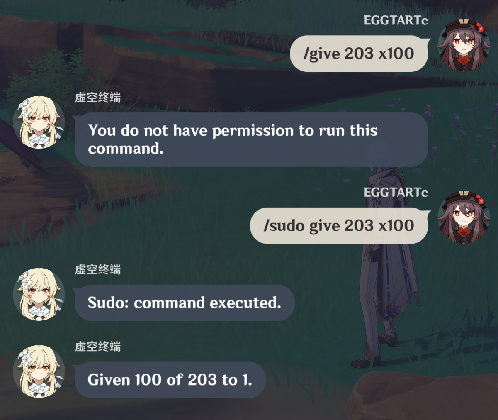

### GCSudoCommand

A practice plugin that brings `sudo` command into Grasscutter private servers.

Currently, no restrictions on the usage of `sudo`, it simply dangerously runs everything unchecked directly on the server, bypassing permission mechanism.

For test use only, do not apply this plugin to public servers.




**Commands are still executed in the name of player while this plugin grants all permissions to the sender temporarily and removes them after the sudo command. The original permission will be backed up and restored as is.**


### Example

```
/sudo give @uid 203 x100
/sudo give 203 x100
/sudo shutdown
/sudo permission @uid clear
...
```

### Version

The plugin template is currently on Grasscutter version `dev-1.4.5`.
